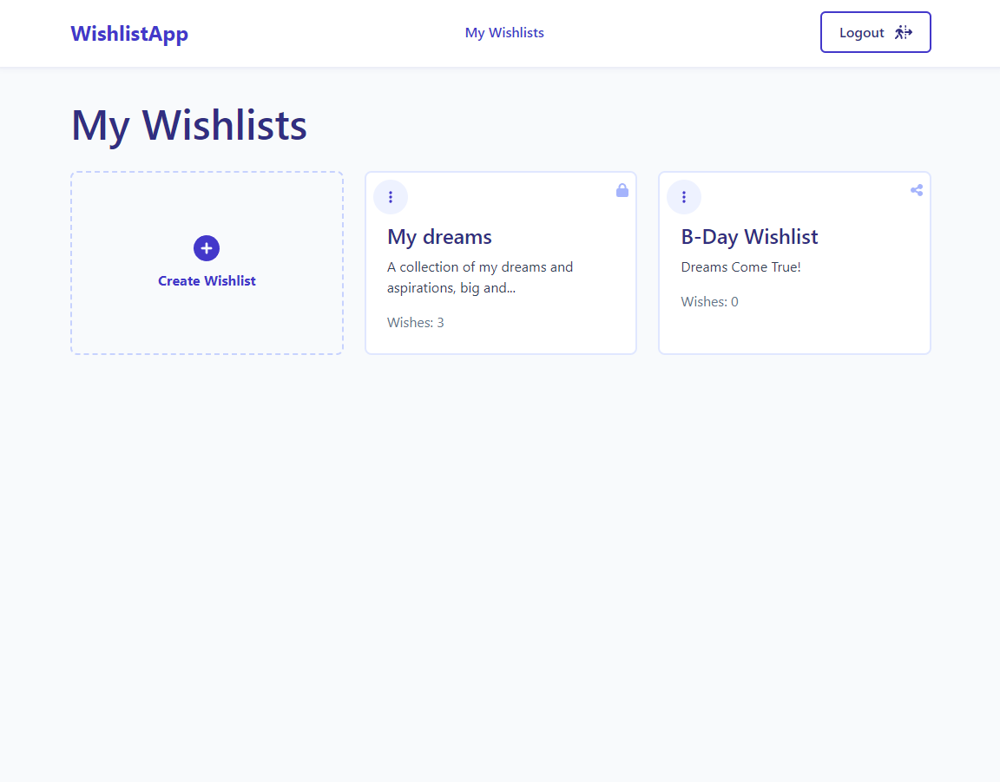

# Wishlist App Frontend


## Table of Contents

- [Introduction](#introduction)
- [Technologies Used](#technologies-used)
- [Project Structure](#project-structure)
- [Features](#features)
- [Setup](#setup)
- [Scripts](#scripts)
- [Story Behind The Project](#story-behind-the-project)
- [Backend Repository](#backend-repository)

## Introduction

This project serves as the frontend for the Wishlist Application. It provides a user-friendly interface for managing personal wishlists and wishes, leveraging Vue.js and Tailwind CSS for a modern and responsive design.

## Technologies Used

- **Vue.js** - Frontend framework for user interface.
- **Vite** - As build tool.
- **Tailwind CSS** - For CSS framework for rapid UI development.
- **Pinia** - As Store for Vue.
- **Axios** - As HTTP client for API calls.
- **Vue Router** - As router for Vue.
- **FontAwesome** - Icons used in the project.

## Project Structure

Here's an overview of the main folders and files in this project:

- **`src/`**: The source code of the application.
  - **`components/`**: All components split by domain.
  - **`views/`**: Views.
  - **`core/`**: Business and Service layers.
  - **`stores/`**: State management with Pinia.
  - **`router/`**: Vue Router configuration.
  - **`assets/`**: Static assets like images and styles.
- **`vite.config.js`**: Configuration file for Vite.
- **`tailwind.config.js`**: Configuration file for Tailwind CSS.

## Features

- **User Authentication**: Log in and registration.
- **Wishlist Management**: Users can create, update, and delete wishlists.
- **Wish Management**: Users can add, update, and remove wishes within wishlists.
- **Responsive Design**: Built with mobile-first approach using Tailwind CSS.

## Setup

To run this project, install it locally using npm:

```bash
git clone https://github.com/OlenaAndrushchenko/wishlist-app-frontend.git
cd wishlist-app-frontend
npm install
```

## Scripts
- Starts the development server.
```bash
npm run dev
```

- Builds the app for production to the dist/ folder.
```bash
npm run build
```

- Runs unit tests with Vitest.
```bash
npm run test:unit
```

- Runs tests with coverage report.
```bash
npm run test:coverage
```

## Project Preview

 
 

## Story Behind the Project

Everyone has dreams, goals, and items they wish to acquire over time. When assigned a project to develop an application, I questioned why not create a platform to capture and manage these personal wishes. Thats how the **Wishlist Application** was born. It allows users to:

- **Create an Account**: Secure registration and login.
- **Manage Wishlists**: Organize wishes into various wishlists.
- **Track Wishes**: Add, edit, and delete wishes with detailed information.

This project not only serves as a practical tool for personal goal setting but also showcases the integration of modern technologies to deliver a seamless user experience.

## Backend Repository
The backend for this application is available [here](https://github.com/OlenaAndrushchenko/wishlist-app-backend)

####
Developed with ❤️ by Olena